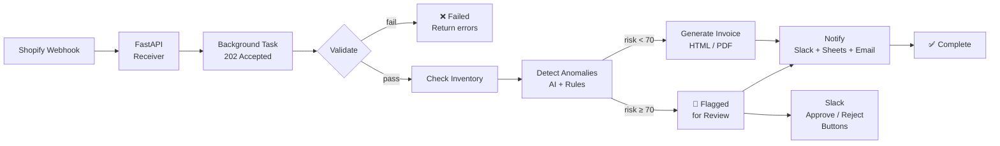
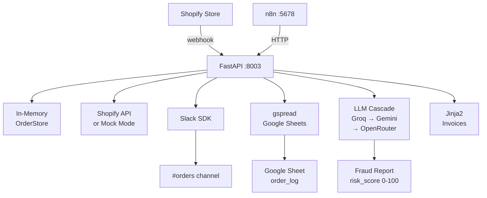
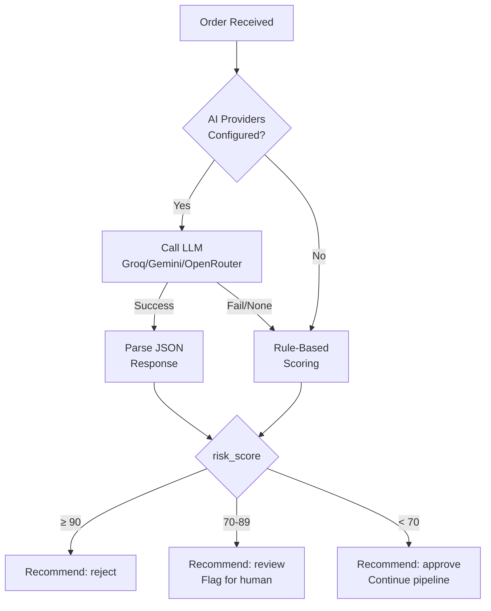

# E-Commerce Order Processing Pipeline — Architecture

## Pipeline Flow

## Integration Map

## Anomaly Detection Decision Tree

## Rule-Based Scoring

| Rule | Trigger | Score |
|------|---------|-------|
| High-value new customer | total > $500, orders_count == 0 | +35 |
| Large quantity | item.quantity > 10 | +30 |
| Country mismatch | shipping.country ≠ billing.country | +25 |
| Free email + high value | gmail/yahoo + total > $1000 | +20 |
| Extreme quantity | item.quantity ≥ 50 | +20 (additional) |

## Key Design Decisions

| Decision | Rationale |
|----------|-----------|
| 202 + background task | Shopify webhooks require sub-5s response |
| In-memory OrderStore | Simplicity for demo; swap with Redis/Postgres for production |
| LLM cascade | Resilience: if Groq fails → Gemini → OpenRouter |
| Rule-based fallback | Deterministic, testable, works without API keys |
| Mock mode | Full demo with zero credentials |
| `asyncio.to_thread` for I/O | Prevents event loop blocking on PDF/file writes |
| Idempotency check | Prevents duplicate processing on webhook retry |
